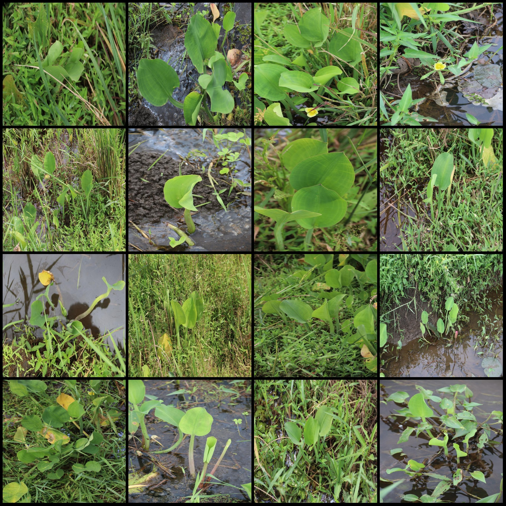
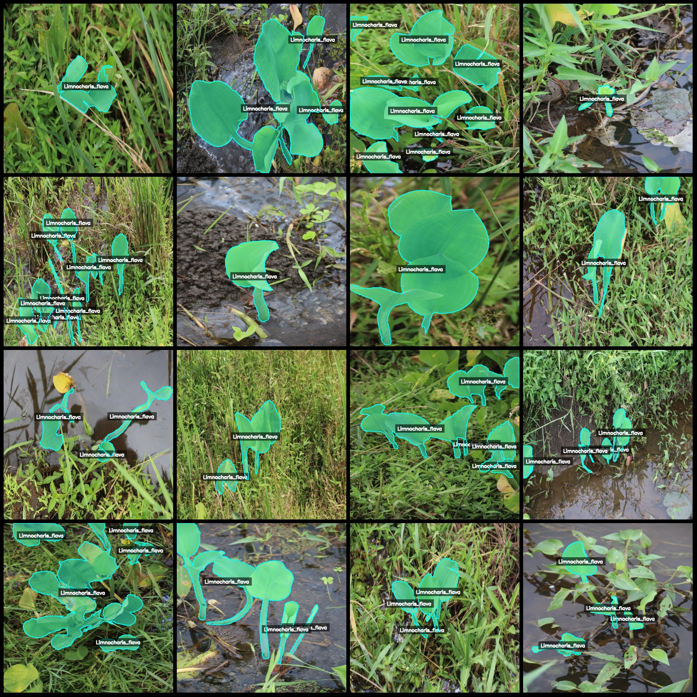
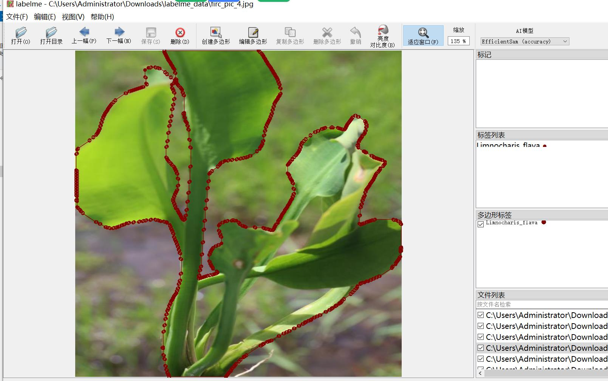

# Water Lily Yellow-flower Leaf Dataset: LabelMe Format with 1003 Images and 1 Category

The dataset format is LabelMe (excluding mask files, only containing JPG images and corresponding JSON files). There are 1003 JPG images and 1003 JSON files. The number of categories is 1. The 
category name in the JSON file is "Limnocharis_flava". Each category has a count of 3471 boxes. The total number of boxes is 3471. The labeling tool used is LabelMe v5.5.0. The image resolution is 
640x640. The labeling rule is to draw polygons for each category. It is important to note that the dataset can be edited using LabelMe, but the JSON dataset needs to be converted into either Mask or 
Yolo or COCO format for semantic segmentation or instance segmentation. Special notice: This dataset does not guarantee the accuracy of the trained models or weight files. Image previews are not 
provided here as they would require actual images to display.

Annotation examples:
Randomly selected 16 images:
Annotation drawing results:
LabelMe editing example:

## Images

Here is a pay link on Stripe ( https://buy.stripe.com/3cs8yP7sY87d0vu9AB ). Please contact me lonlonago@foxmail.com after funding $89, and I will send you a complete data files , thank you!

